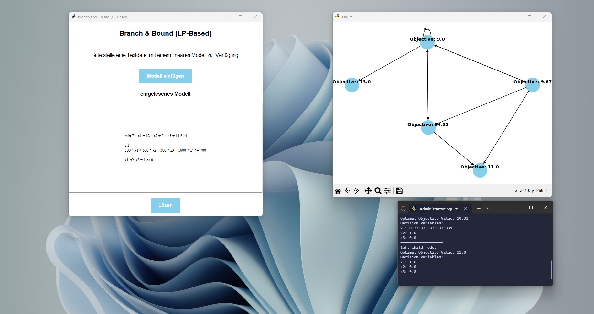

# linear-optimization-graphs
solves mixed integer linear programming problems, generates a graph.

TODO: needs to do that thing correctly.

UPDATE: didn't work as intended. root cause is skill issue. ngmi

## GUI

